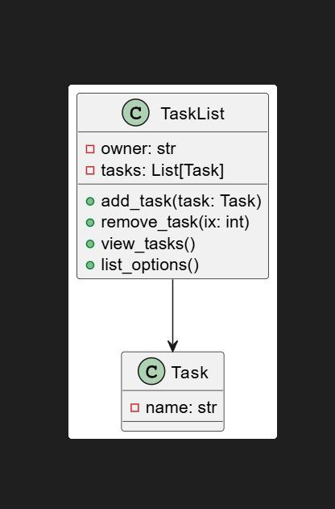
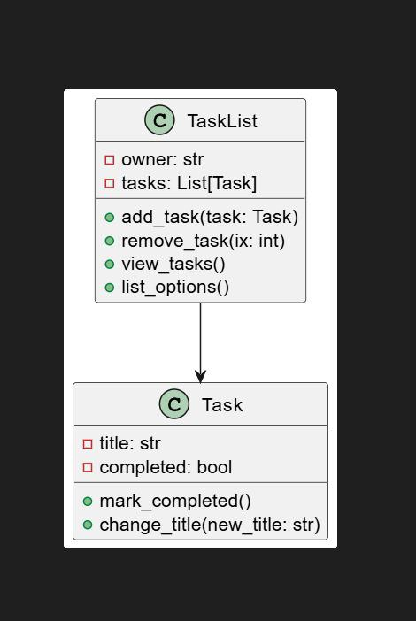
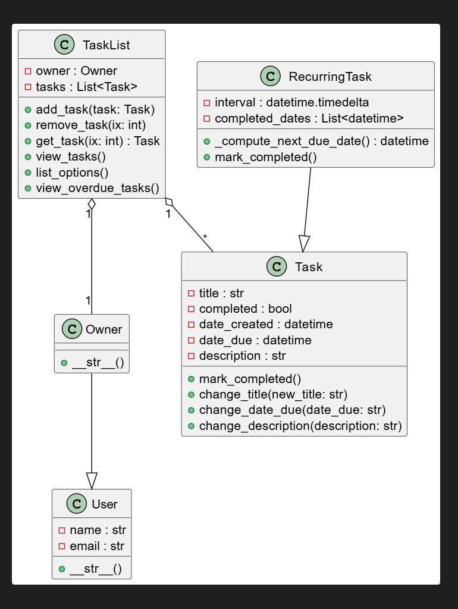
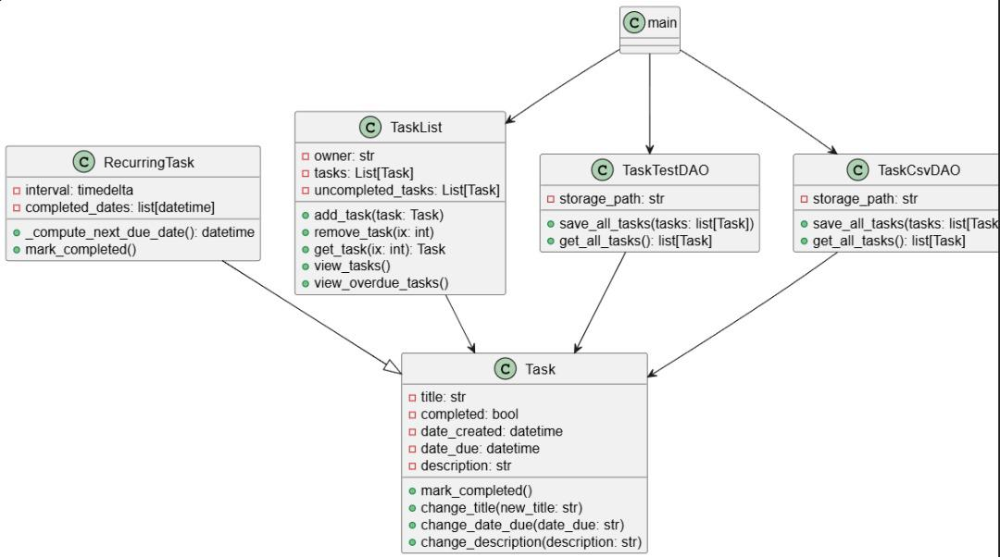
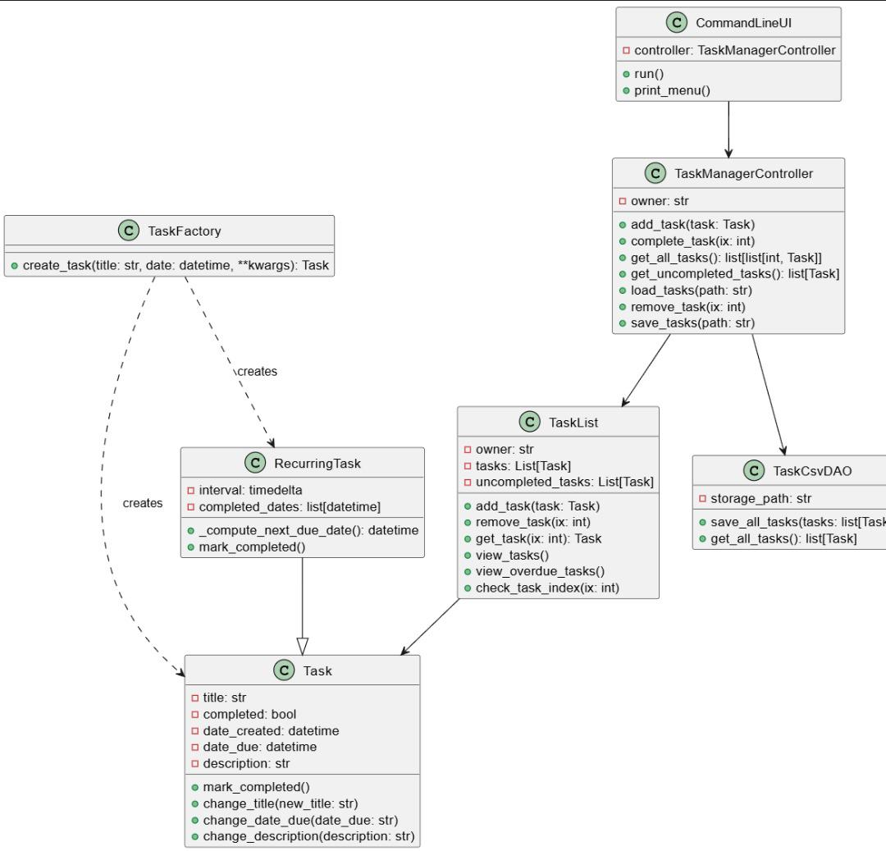
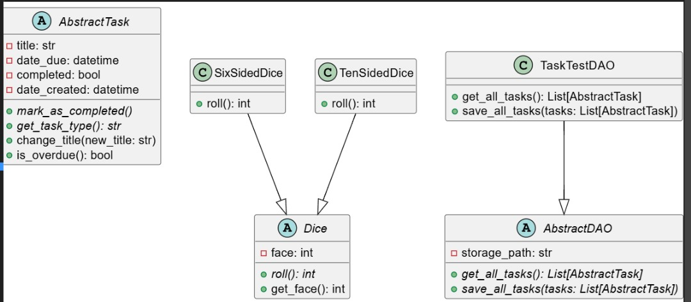
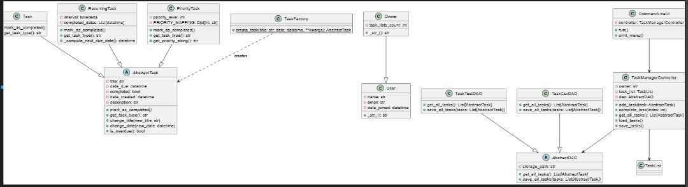

# UNIVERSITY OF THE WEST OF SCOTLAND

MSc Information Technology

School of Computing, Engineering and Physical Sciences

## OBJECT ORIENTED PROGRAMMING (COMP11124) - COURSEWORK
PORTFOLIO OF OBJECT-ORIENTED PROGRAMMING PRACTICALS AND LAB TASKS

LECTURER: Dr Derek Turner

GROUP NUMBER 4

GROUP MEMBERS:
4.1 B01796300 GLORY TITILOPE OLANREWAJU  20%

4.2 B01769775 VICTOR NNAMDI EKWEMALOR  20%

4.3 B01782775 MOSES GANA  20%

4.4 B01796300 IKENNA FRAKLIN EZEMA  20%

4.5 B01798905 VICTOR USMAN  20%


SUBMITTED BY:

Moses Mana Gana – B01782775

CAMPUS: PAISLEY

July 2025

---

## Course Introduction

This portfolio documents the practical implementation and understanding of Object-Oriented Programming concepts through a series of weekly laboratory exercises and assignments. The course progresses systematically from fundamental Python programming concepts to advanced object-oriented design principles and software engineering practices.

### Course Structure

The course is organized into seven progressive weeks, each building upon previous knowledge:

- **Week 2**: Python Fundamentals - Variables, operators, control structures, and basic data manipulation
- **Week 3**: Functions and Error Handling - Modular programming, parameter passing, and exception management
- **Week 4**: Object-Oriented Programming Basics - Classes, objects, encapsulation, and method implementation
- **Week 5**: Advanced OOP Concepts - Inheritance, polymorphism, method overriding, and class hierarchies
- **Week 6**: Data Persistence and Properties - File operations, data serialization, and property decorators
- **Week 7**: Software Design Principles - SOLID principles, design patterns, and architectural considerations
- **Week 8**: Advanced Programming Concepts - Data structures, abstract classes, and interface design

### Learning Approach

Each week combines theoretical understanding with practical implementation through:
- Hands-on coding exercises demonstrating key concepts
- Progressive development of a comprehensive ToDo application
- Real-world problem-solving scenarios
- Integration of multiple programming paradigms and design patterns

The portfolio culminates in a complete software application that demonstrates mastery of object-oriented programming principles and professional software development practices.

### Portfolio Summary

This documentation presents a comprehensive ToDo application that evolves throughout the course:

- **Weeks 2-3**: Foundation with basic Python programming and function implementation
- **Week 4**: Introduction of OOP with Task and TaskList classes
- **Week 5**: Extension with inheritance (RecurringTask) and user management (User/Owner classes)
- **Week 6**: Addition of data persistence using DAO pattern and @property decorators
- **Week 7**: Professional architecture with SOLID principles and Factory pattern
- **Week 8**: Advanced concepts with abstract classes and data structures
- **Portfolio**: Integration of all concepts into a complete, professional application

Each week builds systematically upon previous knowledge, demonstrating both theoretical understanding and practical implementation skills.

### Course Requirements and Tasks

This portfolio addresses all specific tasks and exercises outlined in the course materials:

- **Week 2**: Comparison operators, logical operators, if-elif-else conditionals, and temperature conversion
- **Week 3**: Function implementation including greet_friends, tax calculation, compound interest calculator, and error handling
- **Week 4**: Class creation with Task and TaskList implementation following UML specifications
- **Week 5**: Inheritance with Vehicle/Car examples and RecurringTask implementation
- **Week 6**: Debugging exercises, @property decorators, and DAO pattern implementation
- **Week 7**: SOLID principles application, exception handling, and separation of concerns
- **Week 8**: Data structure tasks (tuple swapping, set intersection, histogram function) and abstract classes

All implementations include comprehensive documentation, type hints, and follow the modular programming principles emphasized throughout the course.

---

# Week 2: Python Fundamentals

## Learning Objectives
After completing this week's exercises, students will be able to:
- Build more complex programs that include conditionals, loops, and lists
- Handle user input effectively
- Apply comparison and logical operators in practical scenarios
- Implement control flow structures (if-else, elif, loops)
- Work with basic data structures and string manipulation

## Topics Covered
- Comparisons and Conditionals
- Lists and Loops
- User Input Handling
- Logical Operators (and, or, not)

## Section 1: Variables and Comparison Operators

This section establishes the foundation of Python programming by exploring variable assignment, data types, and comparison operations. These concepts form the building blocks for more complex programming constructs introduced in later weeks.

### Exercise 1: Comparison Operators

Comparisons in Python compare two or more values and always return a Boolean value (True or False). This exercise demonstrates the fundamental comparison operators used in conditional programming.

```python
# Variables Definition
x = 24  # First number for comparison
y = 51  # Second number for comparison

# Comparison Operators
a1 = x == y   # Equality: 24 == 51 → False
a2 = x != y   # Inequality: 24 != 51 → True
a3 = x > y    # Greater than: 24 > 51 → False
a4 = x < y    # Less than: 24 < 51 → True
a5 = x >= y   # Greater than or equal: 24 >= 51 → False
a6 = x <= y   # Less than or equal: 24 <= 51 → True
```

Output when run:
```console
Comparison Operators
Equality:  False
Inequality:  True
Greater than:  False
Less than:  True
Greater than or equal to:  False
Less than or equal to:  True
```

### Exercise 2: Demonstrating False Conditions

This exercise shows how changing variable values affects comparison results, demonstrating the dynamic nature of variables.

```python
# Making equality operator return False
x = 10  # Change x to a value different from y (51)
a1 = x == y  # 10 == 51 → False

# Making inequality operator return False
x = 51  # Change x to equal y
a2 = x != y  # 51 != 51 → False
```

Output when run:
```console
Equality: where x =  10 and y =  51  the condition is False
Inequality: where x =  51 and y =  51  the condition is False
```

### Exercise 3: Comprehensive Variable and Comparison Example

```python
# Variables and data types
age = 25
name = 'Alice'
is_student = True

print(f'Name: {name}')
print(f'Age: {age}')
print(f'Is student: {is_student}')

# Comparison operators
print(f'Age >= 18: {age >= 18}')
print(f'Age == 25: {age == 25}')
print(f'Name == "Alice": {name == "Alice"}')

# Logical operators
has_license = True
has_car = False
print(f'Has license: {has_license}')
print(f'Has car: {has_car}')
print(f'Can drive: {has_license and has_car}')
print(f'Can travel: {has_license or has_car}')
```

Output when run:
```console
Name: Alice
Age: 25
Is student: True
Age >= 18: True
Age == 25: True
Name == "Alice": True
Has license: True
Has car: False
Can drive: False
Can travel: True
```

## Section 2: Logical Operators

Logical operators combine multiple boolean expressions, essential for complex decision-making in programs.

```python
# Current values: x = 58, y = 51
b1 = x > 10 and y < 100  # AND: both conditions must be True
b2 = x > 10 or y < 100   # OR: at least one condition must be True
b3 = not(x > 10 and y < 100)  # NOT: inverts the result
```

Output when run:
```console
Logical Operators
And:  True
Or:  True
Not:  False
```

## Section 3: Conditional Statements

### Exercise 1: Simple If Statements

```python
# Test 1: Age qualifies as adult
age = 19
age_group = "child"  # Default value
if age > 18:  # Condition: 19 > 18 → True
    age_group = "adult"
    print(f"The age group is {age_group}")
```

Output when run:
```console
The age group is adult
```

### Exercise 2: If-Else Statements

```python
# Wind speed example
wind_speed = 30
if wind_speed < 10:
    print("It is a calm day")
else:
    print("It is a windy day")
```

Output when run:
```console
It is a windy day
```

### Exercise 3: If-Elif-Else Statements

```python
grade = 55
if grade < 50:
    print("You failed")
elif grade < 60:
    print("You passed")
elif grade < 70:
    print("You got a good pass")
else:
    print("You got an excellent pass")
```

Output when run:
```console
You passed
```

## Section 4: Lists and List Operations

Lists are fundamental data structures in Python for storing ordered collections of items.

### Exercise 1: Basic List Operations

```python
# Creating and accessing lists
city_list = ["Glasgow", "London", "Edinburgh"]
print(city_list)  # Output: ['Glasgow', 'London', 'Edinburgh']

# Accessing elements
print(city_list[2])   # Third element: "Edinburgh"
print(city_list[-1])  # Last element: "Edinburgh"

# List slicing
print(city_list[1:3])  # Elements from index 1 to 2: ['London', 'Edinburgh']
```

### Exercise 2: List Modification

```python
# Appending - adds element to the end
city_list.append("Manchester")
print(city_list)  # Output: ['Glasgow', 'London', 'Edinburgh', 'Manchester']

# Removing - removes first occurrence
city_list.remove("Manchester")
print(city_list)  # Output: ['Glasgow', 'London', 'Edinburgh']

# Inserting - adds element at specified index
city_list.insert(1, "Manchester")
print(city_list)  # Output: ['Glasgow', 'Manchester', 'London', 'Edinburgh']

# Replacing - changes element at specified index
city_list[1] = "Birmingham"
print(city_list)  # Output: ['Glasgow', 'Birmingham', 'London', 'Edinburgh']
```

### Exercise 3: List Analysis

```python
# Complete list operations example
fruits = ['apple', 'banana', 'orange']
print('Original fruits:', fruits)
fruits.append('grape')
print('After adding grape:', fruits)
print('First fruit:', fruits[0])
print('Number of fruits:', len(fruits))

# Fruits list with enumeration
print('Fruits list:')
for i, fruit in enumerate(fruits, 1):
    print(f'{i}. {fruit}')
```

Output when run:
```console
Original fruits: ['apple', 'banana', 'orange']
After adding grape: ['apple', 'banana', 'orange', 'grape']
First fruit: apple
Number of fruits: 4

Fruits list:
1. apple
2. banana
3. orange
4. grape
```

## Section 5: Loops

### Exercise 1: For Loops with Lists

```python
# Iterating through list elements
for city in city_list:
    print(city)
```

Output when run:
```console
Glasgow
Birmingham
London
Edinburgh
```

### Exercise 2: For Loops with Range and Break

```python
# Loop with break statement
for i in range(5):
    if i == 2:
        break
    print(i)
```

Output when run:
```console
0
1
```

### Exercise 3: Conditional Processing in Loops

```python
numbers = [1, 2, 3, 4, 5, 6, 7, 8, 9, 10]
for number in numbers:
    if number % 2 == 0:  # Check if even
        print(number)
```

Output when run:
```console
2
4
6
8
10
```

### Exercise 4: Accumulator Pattern

```python
sum_of_squares = 0
for n in range(1, 6):
    sum_of_squares += n ** 2
    print("The sum of squares is: ", sum_of_squares)
```

Output when run:
```console
The sum of squares is:  1
The sum of squares is:  5
The sum of squares is:  14
The sum of squares is:  30
The sum of squares is:  55
```

### Exercise 5: While Loops

```python
countdown = 10
while countdown > 0:
    print(countdown)
    countdown -= 1
print("Liftoff!")
```

Output when run:
```console
10
9
8
7
6
5
4
3
2
1
Liftoff!
```

## Section 6: User Input and Data Conversion

### Exercise 1: Age Classification Program

```python
user_age = int(input("Please enter your age: "))
if user_age <= 17:
    print("You are a minor")
elif user_age >= 18 and user_age < 66:
    print("You are an adult")
else:
    print("You are a senior citizen")
```

Sample Input/Output:
```console
Please enter your age: 45
You are an adult
```

### Exercise 2: Temperature Conversion Program

A comprehensive program demonstrating multiple concepts working together:

```python
temperature_unit = input("Please enter the temperature unit (C, F, K): ")
temperature = float(input("Please enter the temperature: "))
temperature_converter = input("Please enter the temperature unit you want to convert to (C, F, K): ")

# Temperature conversion formulas
celcius_fahrenheit = (temperature * 9/5) + 32
celcius_kelvin = temperature + 273.15
fahrenheit_celcius = (temperature - 32) * 5/9
fahrenheit_kelvin = (temperature - 32) * 5/9 + 273.15
kelvin_celcius = temperature - 273.15
kelvin_fahrenheit = (temperature - 273.15) * 9/5 + 32

if temperature_unit == "C" and temperature_converter == "F":
    print(f"{temperature}C is {celcius_fahrenheit}F")
elif temperature_unit == "C" and temperature_converter == "K":
    print(f"{temperature}C is {celcius_kelvin}K")
# ... additional conversion cases
```

Sample Input/Output:
```console
Please enter the temperature unit (C, F, K): C
Please enter the temperature: 25
Please enter the temperature unit you want to convert to (C, F, K): F
25.0C is 77.0F
```

## Section 4: Additional Course Exercises

### Exercise 4: if-else Conditionals

The if-else conditional allows choosing between two options based on a condition. This exercise demonstrates binary decision-making in programs.

```python
# Wind speed classification
wind_speed = 30

if wind_speed < 10:
    print("It is a calm day")
else:
    print("It is a windy day")
```

Output when run:
```console
It is a windy day
```

### Exercise 5: if-elif-else Conditionals

For multiple conditions, the elif (else-if) statement provides more than two choices. This exercise demonstrates a grading system implementation.

```python
# Grading system
grade = 75

if grade < 50:
    print("You failed")
elif grade < 60:
    print("You passed")
elif grade < 70:
    print("You got a good pass")
else:
    print("You got an excellent pass")
```

Output when run:
```console
You got an excellent pass
```

**Key Concepts:**
- **if-else**: Binary choice between two options
- **elif**: Multiple condition checking in sequence
- **Cascading logic**: Conditions are evaluated in order until one is true

### Week 2 Reflection

Week 2 established the fundamental building blocks of Python programming. The exercises demonstrated how basic concepts like variables, operators, and control structures form the foundation for more complex programming paradigms. Understanding these concepts thoroughly proved essential for the object-oriented programming concepts introduced in later weeks.

The practical exercises showed how Python's syntax and built-in functions provide powerful tools for data manipulation and program control. These skills directly supported the implementation of class methods and object interactions in subsequent weeks.

<hr/>

# Week 3: Functions and Error Handling

## Learning Objectives
After completing this week's exercises, students will be able to:
- Create and use functions as building blocks for larger programs
- Understand variable scope and its implications
- Investigate common errors in Python and implement fixes
- Build a simple To-Do application combining concepts from previous weeks
- Apply modular programming principles for code organization

## Topics Covered
- Functions and Parameters
- Variable Scope
- Assertions and Error Handling
- Common Python Errors (Syntax, Name, Value, Index, Indentation)

## Section 1: Introduction to Functions

This section introduces modular programming through function definition and implementation. Functions provide code reusability, organization, and abstraction - key principles that prepare students for object-oriented programming concepts in subsequent weeks.

### Exercise 1: Basic Function with Parameters

```python
def greet_friends(friend_list):
    """
    Greets each friend in the provided list.

    Parameters:
    friend_list (list): A list of friend names to greet
    """
    for name in friend_list:
        print(f"Hello {name}!")

# Test the function
friend_list = ["John", "Jane", "Jack"]
greet_friends(friend_list)
```

Output when run:
```console
Hello John!
Hello Jane!
Hello Jack!
```

### Exercise 2: Functions with Return Values

```python
def calculate_tax(income, tax_rate):
    """
    Calculates tax amount based on income and tax rate.

    Parameters:
    income (float): The income amount
    tax_rate (float): The tax rate as a decimal

    Returns:
    float: The calculated tax amount
    """
    return income * tax_rate

print("Tax on £50,000 at 20% rate:", calculate_tax(50000, 0.2))
print("Tax on £30,000 at 15% rate:", calculate_tax(30000, 0.15))
```

Output when run:
```console
Tax on £50,000 at 20% rate: 10000.0
Tax on £30,000 at 15% rate: 4500.0
```

## Section 2: Complex Functions with Validation

### Exercise 1: Compound Interest Calculator with Input Validation

```python
def compound_interest(principal, duration, interest_rate):
    """
    Calculates compound interest with input validation.
    Formula: A = P(1 + r)^t
    """
    # Input validation
    if interest_rate < 0 or interest_rate > 1:
        print("Please enter a decimal number between 0 and 1")
        return None
    if duration < 0:
        print("Please enter a positive number of years")
        return None

    # Calculate compound interest for each year
    for year in range(1, duration + 1):
        total = principal * (1 + interest_rate) ** year
        print(f"The total amount of money earned by the investment in year {year} is {total:.0f} £")

    return int(total)

# Test the function
final_amount = compound_interest(1000, 5, 0.03)
print("Final Amount:", final_amount)
```

Output when run:
```console
The total amount of money earned by the investment in year 1 is 1030 £
The total amount of money earned by the investment in year 2 is 1061 £
The total amount of money earned by the investment in year 3 is 1093 £
The total amount of money earned by the investment in year 4 is 1126 £
The total amount of money earned by the investment in year 5 is 1159 £
Final Amount: 1159
```

## Section 3: Testing with Assertions

### Exercise 1: Function Testing

```python
# Use assert to test function returns expected result
assert compound_interest(1000, 5, 0.03) == 1159
```

This assertion tests that our compound interest function returns the correct value. If the assertion fails, the program will stop with an AssertionError, indicating a bug in our function.

## Section 4: Error Handling and Common Python Errors

### Exercise 1: Common Error Types and Fixes

```python
# Fixing Syntax Error - Missing quotes
print("Hello, World!")  # Correct: String properly quoted

# Fixing Name Error - Undefined variable
favorite_color = "Blue"  # Define variable first
print("My favorite color is", favorite_color)

# Fixing Value Error - Type conversion
number1 = "5"  # String
number2 = 3    # Integer
result = int(number1) + number2  # Convert string to int
print("The sum is:", result)

# Fixing Index Error - Invalid list index
fruits = ["apple", "banana", "cherry"]
print(fruits[1])  # Access valid index

# Fixing Indentation Error - Proper code block indentation
time = 11
if time < 12:
    print("Good morning!")  # Properly indented
```

Output when run:
```console
Hello, World!
My favorite color is Blue
The sum is: 8
banana
Good morning!
```

## Section 5: Interactive Console Application

### Exercise 1: To-Do List Manager

A complete interactive program demonstrating advanced concepts:

```python
# Global data structure
tasks = []

def add_task():
    """Add a task to the list"""
    task = input("Enter the task you want to add: ")
    tasks.append(task)
    print(f"Task '{task}' added.")

def view_tasks():
    """Display all current tasks"""
    if not tasks:
        print("No tasks in the list.")
    else:
        print("Current tasks:")
        for i, task in enumerate(tasks, start=1):
            print(f"{i}. {task}")

def remove_task():
    """Remove a task by number with error handling"""
    view_tasks()
    if not tasks:
        return
    try:
        task_number = int(input("Enter the task number to remove: "))
        if 1 <= task_number <= len(tasks):
            removed = tasks.pop(task_number - 1)
            print(f"Task '{removed}' removed.")
        else:
            print("Invalid task number.")
    except ValueError:
        print("Please enter a valid number.")

# Main program loop
while True:
    print("\nTo-Do List Manager")
    print("1. Add a task")
    print("2. View tasks")
    print("3. Remove a task")
    print("4. Quit")

    choice = input("Enter your choice: ")

    if choice == "1":
        add_task()
    elif choice == "2":
        view_tasks()
    elif choice == "3":
        remove_task()
    elif choice == "4":
        print("Exiting program. Goodbye!")
        break
    else:
        print("Invalid choice. Please try again.")
```

Sample Program Interaction:
```console
To-Do List Manager
1. Add a task
2. View tasks
3. Remove a task
4. Quit
Enter your choice: 1
Enter the task you want to add: Buy groceries
Task 'Buy groceries' added.

To-Do List Manager
1. Add a task
2. View tasks
3. Remove a task
4. Quit
Enter your choice: 2
Current tasks:
1. Buy groceries
```

### Week 4 Reflection

Week 4 marked a significant transition from procedural to object-oriented programming. The introduction of classes and objects fundamentally changed how we approach problem-solving in software development. Instead of thinking in terms of functions and data separately, we learned to model real-world entities as cohesive objects with both data (attributes) and behavior (methods).

The Task and TaskList classes demonstrated key OOP principles:
- **Encapsulation**: Data and methods are bundled together within classes
- **Abstraction**: Complex operations are hidden behind simple method interfaces
- **Modularity**: Code is organized into logical, reusable components

This foundation prepared us for more advanced OOP concepts like inheritance and polymorphism in subsequent weeks.

<hr/>

# Week 4: Introduction to Object-Oriented Programming

## Learning Objectives
After completing this week's exercises, students will be able to:
- Create Python classes and use them effectively in code
- Add and use methods and attributes in classes
- Understand how and why to modularize and document code
- Apply object-oriented programming principles to real-world problems
- Implement the Task and TaskList classes for a ToDo application

## Topics Covered
- Python Classes and Objects
- Methods and Attributes
- Object Initialization (__init__ method)
- Modularizing Code
- Documentation using docstrings and comments

## Class Design Overview

The Week 4 implementation introduces two fundamental classes that form the foundation of our ToDo application. The UML diagram below shows the class structure and relationships:


*Figure 4.1: UML Class Diagram showing the relationship between Task and TaskList classes*

### Class Structure Analysis

**TaskList Class:**
- **Attributes**:
  - `owner` (str): Stores the name of the task list owner
  - `tasks` (List[Task]): Python list storing all Task objects
- **Methods**:
  - `add_task(task: Task)`: Adds a Task object to the tasks list
  - `remove_task(ix: int)`: Removes task at specified index
  - `view_tasks()`: Prints all tasks in the list
  - `list_options()`: Handles user interaction and menu display

**Task Class:**
- **Attributes**:
  - `title` (str): Task title/description
- **Methods**: Basic task functionality (to be expanded in later weeks)

The arrow in the UML diagram indicates that TaskList has a composition relationship with Task, meaning TaskList contains and manages Task objects.

## Section 1: Object-Oriented Programming and Classes

This section marks the transition from procedural to object-oriented programming. Students learn to model real-world entities as classes and understand how objects interact within a software system.

### Exercise 1: Basic Class Definition and Instantiation

```python
class TaskList:
    """
    A class to represent a task list with an owner and collection of tasks.

    Attributes:
        owner (str): The name of the task list owner (title case)
        tasks (list): A list of Task objects
    """

    def __init__(self, owner: str) -> None:
        """Constructor method - initializes a new TaskList instance."""
        self.owner = owner.title()  # Convert to title case
        self.tasks = []  # Initialize empty list

    def add_task(self, task: 'Task') -> None:
        """Adds a task to the task list."""
        self.tasks.append(task)
        print(f"Task '{task}' added.")

# Create an instance (object) of the TaskList class
task_list = TaskList("john doe")
print(f"Welcome {task_list.owner}")  # Output: Welcome John Doe
```

### Exercise 2: Enhanced Task Class with Special Methods


*Figure 4.2: UML Class Diagram showing Enhanced Task Class with Special Methods*
```python
class Task:
    """Represents an individual task with title, dates, and completion status."""

    def __init__(self, title: str, date_due: datetime.datetime) -> None:
        """Initialize a new Task instance."""
        self.title = title
        self.date_created = datetime.datetime.now()
        self.date_due = date_due
        self.completed = False

    def __str__(self) -> str:
        """String representation of the Task object."""
        status = "[Completed]" if self.completed else "[Not Completed]"
        return f"{self.title} {status} Created: {self.date_created} Due: {self.date_due}"

    def mark_as_completed(self) -> None:
        """Mark the task as completed."""
        self.completed = True
        print(f"Task '{self.title}' is completed.")
```

Sample Program Interaction:
```console
Enter the name of the owner: momo
Welcome Momo

To-Do List Manager
1. Add a task
2. View tasks
3. Remove a task
4. Mark task as completed
5. Edit task
6. Quit
Enter your choice: 1
Enter the task you want to add: swim
Enter a due date (YYYY-MM-DD): 2025-10-23
Task 'swim [Not Completed] Created: 2025-06-15 22:00:27.343566 Due: 2025-10-23 00:00:00' added.

To-Do List Manager
Enter your choice: 2
Current tasks:
1. swim [Not Completed] Created: 2025-06-15 22:00:27.343566 Due: 2025-10-23 00:00:00
```

## Section 2: Code Modularization and Imports

### Exercise 1: Separating Classes into Modules

**File Structure:**
```
ToDoApp/
├── main.py        # Main application logic
├── task.py        # Task class definition
└── task_list.py   # TaskList class definition
```

**task.py - Task Module:**
```python
"""
Task Module - Object-Oriented Task Management
"""
import datetime

class Task:
    def __init__(self, title: str, date_due: datetime.datetime) -> None:
        self.title = title
        self.date_created = datetime.datetime.now()
        self.date_due = date_due
        self.completed = False

    def __str__(self) -> str:
        status = "[Completed]" if self.completed else "[Not Completed]"
        return f"{self.title} {status} Created: {self.date_created} Due: {self.date_due}"
```

**task_list.py - TaskList Module:**
```python
"""
TaskList Module - Task Collection Management
"""
from task import Task  # Import Task class from task module

class TaskList:
    def __init__(self, owner: str) -> None:
        self.owner = owner.title()
        self.tasks: list[Task] = []  # Type hint with generic

    def add_task(self, task: Task) -> None:
        self.tasks.append(task)
        print(f"Task '{task}' added.")
```

**main.py - Main Application:**
```python
"""
Main Application Module - Modularized To-Do List Manager
"""
from task_list import TaskList  # Import from task_list module
from task import Task           # Import from task module
import datetime

def main() -> None:
    input_owner = input("Enter the name of the owner: ")
    task_list = TaskList(input_owner)
    # Application logic continues...

if __name__ == "__main__":
    main()
```

## Section 3: Type Hints and Type Checking

### Exercise 1: Function Type Hints

```python
def propagate_task_list(task_list: TaskList) -> TaskList:
    """
    Populate a task list with sample tasks for testing purposes.

    Args:
        task_list (TaskList): The task list to populate with sample data

    Returns:
        TaskList: The same task list instance with added sample tasks
    """
    task_list.add_task(Task("Buy groceries", datetime.datetime.now()))
    return task_list
```

### Exercise 2: Class Attribute Type Hints

```python
class TaskList:
    def __init__(self, owner: str) -> None:
        self.owner: str = owner.title()
        self.tasks: list[Task] = []  # Generic type hint

    def add_task(self, task: Task) -> None:
        """Type hints specify expected parameter and return types."""
        self.tasks.append(task)

    def remove_task(self, ix: int) -> None:
        """Type hints improve code documentation and IDE support."""
        try:
            del self.tasks[ix]
        except IndexError:
            print("Please enter a valid number.")
```

## Section 4: Enhanced Portfolio Project

### Exercise 1: Extended Task Class with Descriptions

```python
class Task:
    """Enhanced Task class with description support."""

    def __init__(self, title: str, date_due: datetime.datetime, description: str) -> None:
        self.title = title
        self.date_created = datetime.datetime.now()
        self.date_due = date_due
        self.completed = False
        self.description = description  # Enhanced feature

    def __str__(self) -> str:
        status = "[Completed]" if self.completed else "[Not Completed]"
        return f"{self.title} {status} Created: {self.date_created} Due: {self.date_due} Description: {self.description}"

    def change_description(self, new_description: str) -> None:
        """Enhanced method for changing task description."""
        self.description = new_description
        print(f"Task description changed to '{self.description}'")
```

### Exercise 2: Advanced TaskList with Overdue Filtering

```python
class TaskList:
    """Enhanced TaskList with overdue task filtering."""

    def view_overdue_tasks(self) -> None:
        """Display only overdue tasks with numbering."""
        if not self.tasks:
            print("No tasks in the list.")
        else:
            print("Overdue tasks:")
            overdue_count = 0

            for i, task in enumerate(self.tasks, start=1):
                if task.date_due < datetime.datetime.now():
                    print(f"{i}. {task}")
                    overdue_count += 1

            if overdue_count == 0:
                print("No overdue tasks found.")
```

Sample Enhanced Application Interaction:
```console
To-Do List Manager - Portfolio Edition
1. Add a task
2. View tasks
3. View overdue tasks
4. Remove a task
5. Mark task as completed
6. Edit task
7. Quit
Enter your choice: 1
Enter the task you want to add: Complete project
Enter a due date (YYYY-MM-DD): 2024-01-15
Would you like to add a description? (y/n): y
Enter the description: Finish the portfolio project for OOP module
Task 'Complete project [Not Completed] Created: ... Due: 2024-01-15 Description: Finish the portfolio project for OOP module' added.

Enter your choice: 3
Overdue tasks:
1. Complete project [Not Completed] Created: ... Due: 2024-01-15 Description: Finish the portfolio project for OOP module
```

## Section 5: Error Handling and Exception Management

### Exercise 1: Comprehensive Error Handling

```python
def main() -> None:
    while True:
        try:
            # Application logic here
            choice = input("Enter your choice: ")
            if choice == "1":
                # Task creation with date parsing
                input_date = input("Enter a due date (YYYY-MM-DD): ")
                date_object = datetime.datetime.strptime(input_date, "%Y-%m-%d")

        except ValueError:  # Handle invalid number conversions and date parsing
            print("Please enter a valid number or date format (YYYY-MM-DD).")
        except IndexError:  # Handle invalid list indices
            print("Please enter a valid task number.")
        except Exception as e:  # Handle any other unexpected errors
            print(f"An error occurred: {e} Please try again.")
```

### Exercise 2: Class-Level Error Handling

```python
class TaskList:
    def remove_task(self, ix: int) -> None:
        """Remove a task with proper error handling."""
        try:
            my_task = self.tasks[ix]
            del self.tasks[ix]
            print(f"Task '{my_task}' removed.")
        except IndexError:  # Handle invalid index gracefully
            print("Please enter a valid number.")
```
<hr/>

# Week 5: Inheritance and Polymorphism

## Learning Objectives
After completing this week's exercises, students will be able to:
- Critically evaluate the use of inheritance and polymorphism
- Demonstrate the use of inheritance and polymorphism in Python
- Understand how inheritance and polymorphism are used in OOP
- Create subclasses and override methods effectively
- Use the super() function to call parent class methods

## Topics Covered
- Python Inheritance
- Polymorphism and Method Overriding
- The super() Function
- Class Hierarchies and "is-a" Relationships

## Class Hierarchy Design

Week 5 extends the ToDo application by introducing inheritance relationships and specialized task types:


*Figure 5.1: UML Class Diagram showing inheritance relationships and polymorphic behavior*

## Section 1: Inheritance and Method Overriding

This section explores how inheritance enables code reuse and specialization. Students learn to create class hierarchies where child classes extend and modify parent class behavior through method overriding.

### Exercise 1: Simple Inheritance

```python
class Vehicle:
    """Base vehicle class with common attributes and methods."""

    def __init__(self, colour, weight, max_speed, max_range=None, seats=None):
        self.colour = colour
        self.weight = weight
        self.max_speed = max_speed
        self.max_range = max_range
        self.seats = seats

    def move(self, speed):
        print(f"The vehicle is moving at {speed} km/h")

class Car(Vehicle):
    """Car class inheriting from Vehicle with form_factor attribute."""

    def __init__(self, colour, weight, max_speed, form_factor, max_range=None, seats=None):
        super().__init__(colour, weight, max_speed, max_range, seats)
        self.form_factor = form_factor

    def move(self, speed):
        print(f"The car is driving at {speed} km/h")

# Test inheritance
car = Car("blue", 1500, 250, "SUV")
car.move(150)  # Output: The car is driving at 150 km/h
```

### Exercise 2: Method Overriding and Super()

```python
class Electric(Car):
    """Electric car with battery capacity."""

    def __init__(self, colour, weight, max_speed, form_factor, battery_capacity, **kwargs):
        super().__init__(colour, weight, max_speed, form_factor, **kwargs)
        self.battery_capacity = battery_capacity

    def move(self, speed):
        print(f"The electric car is driving at {speed} km/h")

class Petrol(Car):
    """Petrol car with fuel capacity."""

    def __init__(self, colour, weight, max_speed, form_factor, fuel_capacity, **kwargs):
        super().__init__(colour, weight, max_speed, form_factor, **kwargs)
        self.fuel_capacity = fuel_capacity

    def move(self, speed):
        print(f"The petrol car is driving at {speed} km/h")
```

Output when run:
```console
The electric car is driving at 100 km/h
The petrol car is driving at 150 km/h
```

## Section 2: Polymorphism and **kwargs

### Exercise 1: Polymorphic Behavior

```python
# Polymorphism demonstration - same method name, different behaviors
for movable_object in [generic_vehicle, electric_car, generic_flying_car, generic_animal]:
    movable_object.move(20)
```

Output when run:
```console
The vehicle is moving at 20 km/h
The electric car is driving at 20 km/h
The flying car is driving or flying at 20 km/h
The animal is moving at a speed of 20
```

### Exercise 2: Using **kwargs for Flexible Parameters

```python
class ElectricTask2(Car):
    """Electric car demonstrating **kwargs usage."""

    def __init__(self, colour, weight, max_speed, form_factor, battery_capacity, **kwargs):
        super().__init__(colour, weight, max_speed, form_factor, **kwargs)
        self.battery_capacity = battery_capacity

    def move(self, speed):
        range_info = self.max_range if self.max_range else "Unknown"
        print(f"The electric car is driving at {speed} km/h and has a maximum range of {range_info} km")

# Test **kwargs functionality
electric_car_t2 = ElectricTask2("green", 1000, 200, "Hatchback", 100, max_range=500, seats=5)
electric_car_t2.move(100)
print(f"Electric car seats: {electric_car_t2.seats}")
```

Output when run:
```console
The electric car is driving at 100 km/h and has a maximum range of 500 km
Electric car seats: 5
```

## Section 3: Multiple Inheritance

### Exercise 1: Complex Inheritance Hierarchies

```python
class Plane(Vehicle):
    """Plane class with aviation-specific attributes."""

    def __init__(self, colour, weight, max_speed, num_engines, wingspan, **kwargs):
        super().__init__(colour, weight, max_speed, **kwargs)
        self.num_engines = num_engines
        self.wingspan = wingspan

    def move(self, speed):
        print(f"The plane is flying at {speed} km/h")

class FlyingCar(Car, Plane):
    """Flying car demonstrating multiple inheritance."""

    def __init__(self, colour, weight, max_speed, form_factor, wingspan, **kwargs):
        Car.__init__(self, colour, weight, max_speed, form_factor, **kwargs)
        self.wingspan = wingspan

    def move(self, speed):
        print(f"The flying car is driving or flying at {speed} km/h")

# Test multiple inheritance
flying_car = FlyingCar("red", 1000, 200, "SUV", 30, seats=5)
flying_car.move(100)
print(flying_car.seats, flying_car.wingspan, flying_car.form_factor)
```

Output when run:
```console
The flying car is driving or flying at 100 km/h
None 30 SUV
```

## Section 4: Practical OOP Implementation

### Exercise 1: RecurringTask with Polymorphism

```python
class Task:
    """Base task class with standard functionality."""

    def __init__(self, title: str, date_due: datetime.datetime) -> None:
        self.title = title
        self.date_created = datetime.datetime.now()
        self.date_due = date_due
        self.completed = False

    def mark_as_completed(self) -> None:
        """Mark task as completed."""
        self.completed = True
        print(f"Task '{self.title}' is completed.")

class RecurringTask(Task):
    """Recurring task demonstrating inheritance and polymorphism."""

    def __init__(self, title: str, date_due: datetime.datetime, interval: datetime.timedelta):
        super().__init__(title, date_due)
        self.interval = interval
        self.completed_dates: list[datetime.datetime] = []

    def mark_as_completed(self) -> None:
        """Override parent method - demonstrates polymorphism."""
        self.completed_dates.append(datetime.datetime.now())
        self.date_due = self.date_due + self.interval
        print(f"Recurring task '{self.title}' completed. Next due date: {self.date_due}")
```

### Exercise 2: Encapsulation with get_task Method

```python
class TaskList:
    """Enhanced TaskList with encapsulation and filtering capabilities."""

    def get_task(self, index: int) -> Task:
        """Get task at specified index - demonstrates encapsulation."""
        if 0 <= index < len(self.tasks):
            return self.tasks[index]
        else:
            raise IndexError("Task index out of range")

# Usage demonstrating encapsulation
task = task_list.get_task(completed - 1)
task.mark_as_completed()  # Polymorphic method call
```

**Polymorphism in Action:**
```python
# Test polymorphism with different task types
regular_task = Task('Buy groceries', datetime.datetime.now() + datetime.timedelta(days=1))
recurring_task = RecurringTask('Go to gym', datetime.datetime.now() + datetime.timedelta(days=1), datetime.timedelta(days=7))

print('Regular task completion:')
regular_task.mark_as_completed()

print('Recurring task completion:')
recurring_task.mark_as_completed()
```

Output when run:
```console
Regular task completion:
Task 'Buy groceries' is completed.

Recurring task completion:
Recurring task 'Go to gym' completed. Next due date: 2025-07-26 03:31:02.019627
```

<hr/>

# Week 6: Data Persistence and Property Management

## Learning Objectives
After completing this week's exercises, students will be able to:
- Understand and apply debugging techniques to code
- Design and implement persistence following OOP principles
- Demonstrate the use of Python @property decorator for managed attributes
- Use debugging tools to find and fix logical errors
- Implement the DAO pattern for data persistence

## Topics Covered
- Debugging Techniques and Tools
- Python @property Decorator
- Persistence using DAO Pattern with CSV and Pickle
- Finding and Fixing Logical Errors

## System Architecture Overview

Week 6 introduces data persistence and property management, expanding the ToDo application with professional data access patterns:




*Figure 6.1: UML Class Diagram showing DAO pattern implementation and data persistence architecture*

## Section 1: Property Decorators and Computed Attributes

This section introduces Python's @property decorator, which allows methods to be accessed like attributes while maintaining encapsulation. This concept is essential for creating clean, maintainable interfaces in object-oriented design.

### Exercise 1: @Property Decorator Implementation

```python
class TaskList:
    """Enhanced TaskList with @property decorators for computed attributes."""

    def __init__(self, owner: str) -> None:
        """Initialize TaskList with owner name."""
        self.owner = owner.title()
        self.tasks: list[Task] = []

    @property
    def uncompleted_tasks(self) -> list[Task]:
        """Property to get all uncompleted tasks - demonstrates @property decorator."""
        return [task for task in self.tasks if not task.completed]

    def view_tasks(self) -> None:
        """Display only uncompleted tasks using the property."""
        if not self.uncompleted_tasks:
            print("No uncompleted tasks in the list.")
        else:
            print("The following tasks are still to be done:")
            for task in self.uncompleted_tasks:
                ix = self.tasks.index(task) + 1
                print(f"{ix}: {task}")
```

**Key Benefits of @property:**
- **Attribute-like access**: `task_list.uncompleted_tasks` (no parentheses)
- **Dynamic computation**: Always returns current state
- **Encapsulation**: Hides filtering logic implementation

### Exercise 2: Property Usage in Practice

```python
# Using the property feels like accessing an attribute
task_list = TaskList("John")
task_list.add_task(Task("Buy groceries", datetime.datetime.now()))
task_list.add_task(Task("Walk dog", datetime.datetime.now()))

# Property automatically filters uncompleted tasks
print(f"Uncompleted tasks: {len(task_list.uncompleted_tasks)}")

# Mark one task as completed
task_list.tasks[0].mark_as_completed()

# Property reflects the change immediately
print(f"Uncompleted tasks: {len(task_list.uncompleted_tasks)}")
```

Output when run:
```console
Task 'Buy groceries [Not Completed] Created: 2025-07-18 03:29:07.541143 Due: 2025-07-18 03:29:07.541135' added.
Task 'Walk dog [Not Completed] Created: 2025-07-18 03:29:07.541543 Due: 2025-07-18 03:29:07.541539' added.
Uncompleted tasks: 2
Task 'Buy groceries' is completed.
Uncompleted tasks: 1
```

## Section 2: DAO Pattern Implementation

### Exercise 1: Test DAO for Development

```python
class TaskTestDAO:
    """Test Data Access Object providing hardcoded test data."""

    def __init__(self, storage_path: str = "test_data") -> None:
        """Initialize test DAO with storage path identifier."""
        self.storage_path = storage_path

    def get_all_tasks(self) -> list[Task]:
        """Retrieve all tasks from test data - simulates loading from storage."""
        task_list = [
            Task("Buy groceries", datetime.datetime.now() - datetime.timedelta(days=4)),
            Task("Do laundry", datetime.datetime.now() - datetime.timedelta(days=-2)),
            Task("Clean room", datetime.datetime.now() + datetime.timedelta(days=-1)),
            Task("Do homework", datetime.datetime.now() + datetime.timedelta(days=3)),
            Task("Walk dog", datetime.datetime.now() + datetime.timedelta(days=5)),
            Task("Do dishes", datetime.datetime.now() + datetime.timedelta(days=6))
        ]

        # Sample recurring task
        r_task = RecurringTask("Go to the gym", datetime.datetime.now(), datetime.timedelta(days=7))
        r_task.completed_dates.append(datetime.datetime.now() - datetime.timedelta(days=7))
        task_list.append(r_task)

        print(f"Loaded {len(task_list)} test tasks from {self.storage_path}")
        return task_list

    def save_all_tasks(self, tasks: list[Task]) -> None:
        """Save all tasks - test implementation with simulated saving."""
        print(f"Simulated saving {len(tasks)} tasks to {self.storage_path}")
        for i, task in enumerate(tasks, 1):
            print(f"  {i}. {task.title} - {'Completed' if task.completed else 'Not Completed'}")

# Test DAO usage
dao = TaskTestDAO()
tasks = dao.get_all_tasks()
dao.save_all_tasks(tasks[:3])  # Save first 3 tasks
```

Output when run:
```console
Loaded 7 test tasks from test_data
Simulated saving 3 tasks to test_data
  1. Buy groceries - Not Completed
  2. Do laundry - Not Completed
  3. Clean room - Not Completed
```

### Exercise 2: CSV DAO for Persistent Storage

```python
class TaskCsvDAO:
    """CSV Data Access Object for persistent task storage."""

    def __init__(self, storage_path: str) -> None:
        """Initialize CSV DAO with file path."""
        self.storage_path = storage_path

    def save_all_tasks(self, tasks: list[Task]) -> None:
        """Save all tasks to CSV file using DictWriter."""
        fieldnames = ["title", "type", "date_due", "completed", "interval", "completed_dates", "date_created"]

        try:
            with open(self.storage_path, 'w', newline='', encoding='utf-8') as file:
                writer = csv.DictWriter(file, fieldnames=fieldnames)
                writer.writeheader()

                for task in tasks:
                    row = {"title": task.title}

                    if isinstance(task, RecurringTask):
                        row["type"] = "RecurringTask"
                        row["interval"] = str(task.interval.days)
                        row["completed_dates"] = ','.join([
                            date.strftime("%Y-%m-%d") for date in task.completed_dates
                        ])
                    else:
                        row["type"] = "Task"
                        row["interval"] = ""
                        row["completed_dates"] = ""

                    row["date_due"] = task.date_due.strftime("%Y-%m-%d")
                    row["completed"] = str(task.completed)
                    row["date_created"] = task.date_created.strftime("%Y-%m-%d")

                    writer.writerow(row)

            print(f"Saved {len(tasks)} tasks to {self.storage_path}")

        except Exception as e:
            print(f"Error saving tasks to {self.storage_path}: {e}")

    def get_all_tasks(self) -> list[Task]:
        """Load all tasks from CSV file using DictReader."""
        task_list = []

        try:
            with open(self.storage_path, 'r', encoding='utf-8') as file:
                reader = csv.DictReader(file)

                for row in reader:
                    try:
                        # Parse basic task data
                        date_due = datetime.datetime.strptime(row["date_due"], "%Y-%m-%d")
                        date_created = datetime.datetime.strptime(row["date_created"], "%Y-%m-%d")
                        completed = row["completed"].lower() == 'true'

                        # Create task based on type
                        if row["type"] == "RecurringTask":
                            interval_days = int(row["interval"]) if row["interval"] else 7
                            interval = datetime.timedelta(days=interval_days)
                            task = RecurringTask(row["title"], date_due, interval)

                            # Parse completed dates
                            if row["completed_dates"]:
                                task.completed_dates = []
                                for date_str in row["completed_dates"].split(','):
                                    if date_str.strip():
                                        completed_date = datetime.datetime.strptime(date_str.strip(), "%Y-%m-%d")
                                        task.completed_dates.append(completed_date)
                        else:
                            task = Task(row["title"], date_due)

                        # Set common properties
                        task.date_created = date_created
                        task.completed = completed
                        task_list.append(task)

                    except (ValueError, KeyError) as e:
                        print(f"Error parsing task row: {e}")
                        continue

            print(f"Loaded {len(task_list)} tasks from {self.storage_path}")

        except FileNotFoundError:
            print(f"No existing task file found at {self.storage_path}. Starting with empty task list.")
        except Exception as e:
            print(f"Error loading tasks from {self.storage_path}: {e}")

        return task_list

# Test CSV DAO usage
csv_dao = TaskCsvDAO('test_tasks.csv')
tasks = [
    Task('Buy groceries', datetime.datetime(2024, 1, 20)),
    Task('Do laundry', datetime.datetime(2024, 1, 22))
]
csv_dao.save_all_tasks(tasks)
loaded_tasks = csv_dao.get_all_tasks()
```

Output when run:
```console
Saved 2 tasks to test_tasks.csv
Loaded 2 tasks from test_tasks.csv
```

**Generated CSV file content:**
```csv
title,type,date_due,completed,interval,completed_dates,date_created
Buy groceries,Task,2024-01-20,False,,,2025-07-18
Do laundry,Task,2024-01-22,False,,,2025-07-18
```

## Section 3: Debugging and Error Handling

### Exercise 1: Debugging Practice

```python
class Car:
    """Car class with intentional bugs for debugging practice."""

    def __init__(self, speed: str = 0) -> None:  # Bug: speed should be int, not str
        self.speed = speed
        self.odometer = 0
        self.time = 0

    def accelerate(self) -> None:
        self.speed += 5

    def brake(self):
        self.speed -= 5

    def step(self) -> None:  # Bug: extra space in type hint
        self.odometer += self.speed
        self.time += 1

    def average_speed(self) -> float:
        return self.odometer / self.time  # Bug: potential division by zero
```

**Common Debugging Issues:**
- **Type Hint Errors**: Wrong data types in function signatures
- **Logic Errors**: Division by zero, incorrect calculations
- **Runtime Errors**: Missing error handling for edge cases

**Fixed Version Example:**
```python
# Test the fixed car
my_car = Car(0)  # Fixed: proper int type
my_car.accelerate()
my_car.step()
print(f'Speed: {my_car.speed}, Odometer: {my_car.odometer}, Average: {my_car.average_speed()}')
```

Output when run:
```console
Initial state: Speed: 0, Odometer: 0, Time: 0
After accelerate and step: Speed: 5, Odometer: 5, Time: 1
Average speed: 5.0
```

## Section 4: Practical Application Integration

### Exercise 1: DAO Pattern in Main Application

```python
def main() -> None:
    """Main application demonstrating DAO pattern and @property decorators."""
    input_owner = input("Enter the name of the owner: ")
    task_list = TaskList(input_owner)
    print(f"Welcome {task_list.owner}")

    dao = None

    while True:
        print("\nTo-Do List Manager - Week 6 with DAO Pattern")
        print("7. Load tasks from DAO")
        print("8. Save tasks to DAO")

        choice = input("Enter your choice: ")

        if choice == "7":  # Load tasks
            dao_type = input("Choose DAO type (test/csv/pickle): ").lower()
            if dao_type == "test":
                dao = TaskTestDAO()
            elif dao_type == "csv":
                dao = TaskCsvDAO("tasks.csv")
            elif dao_type == "pickle":
                dao = TaskPickleDAO("tasks.pkl")

            if dao:
                loaded_tasks = dao.get_all_tasks()
                task_list.tasks = loaded_tasks

        elif choice == "8":  # Save tasks
            if dao:
                dao.save_all_tasks(task_list.tasks)
            else:
                print("Please load a DAO first (option 7)")
```

Sample Program Interaction:
```console
To-Do List Manager - Week 6 with DAO Pattern
1. Add a task
2. View tasks
7. Load tasks from DAO
8. Save tasks to DAO
9. Quit
Enter your choice: 7
Choose DAO type (test/csv/pickle): csv
Loaded 7 tasks from tasks.csv
Enter your choice: 2
The following tasks are still to be done:
1: Buy groceries [Not Completed] Created: 2024-01-15 Due: 2024-01-20
2: Do laundry [Not Completed] Created: 2024-01-16 Due: 2024-01-22
```

<hr/>

# Week 7: Software Design Principles and Patterns

## Learning Objectives
After completing this week's exercises, students will be able to:
- Discuss the fundamental principles of SOLID and their significance in software design
- Critically appraise code examples to identify SOLID principle violations
- Demonstrate proficiency in handling exceptions in Python
- Understand the separation of concerns principle and how to apply it
- Propose code refactoring to adhere to SOLID principles

## Topics Covered
- SOLID Principles (Single Responsibility, Open/Closed, Liskov Substitution, Interface Segregation, Dependency Inversion)
- Python Exceptions (raising and catching)
- Separation of Concerns in the ToDo App
- Code Refactoring and Design Patterns

## Application Architecture Design

Week 7 transforms the ToDo application into a professionally architected system following industry-standard design principles:



*Figure 7.1: UML Class Diagram showing complete application architecture with SOLID principles and design patterns*

## Section 1: SOLID Principles Implementation

This section introduces the five SOLID principles of object-oriented design, demonstrating how these principles create maintainable, extensible, and robust software systems. Each principle is illustrated through practical implementation in the ToDo application.

### Exercise 1: Single Responsibility Principle

```python
class CommandLineUI:
    """Command-line UI demonstrating separation of concerns."""

    def __init__(self) -> None:
        """Initialize UI with controller instance."""
        self.controller: TaskManagerController = None

    def display_menu(self) -> None:
        """Display main menu - UI responsibility only."""
        print("\nTo-Do List Manager - Week 7 SOLID Principles")
        print("1. Add a task")
        print("2. View tasks")
        print("3. View overdue tasks")
        print("4. Remove a task")
        print("5. Mark task as completed")

class TaskManagerController:
    """Controller demonstrating SOLID principles and separation of concerns."""

    def __init__(self, owner: str) -> None:
        """Initialize controller with task list owner."""
        self.task_list = TaskList(owner)
        self.dao: Optional[Any] = None

    def create_task(self, title: str, due_date: datetime.datetime,
                   is_recurring: bool = False, interval_days: int = 7) -> bool:
        """Create task using Factory pattern with exception handling."""
        try:
            if is_recurring:
                interval = datetime.timedelta(days=interval_days)
                task = TaskFactory.create_task(title, due_date, interval=interval)
            else:
                task = TaskFactory.create_task(title, due_date)

            self.task_list.add_task(task)
            return True
        except Exception as e:
            print(f"Error creating task: {e}")
            return False
```

**Key Benefits:**
- **Single Responsibility**: UI only handles presentation, Controller only handles business logic
- **Separation of Concerns**: Clear boundaries between different layers
- **Maintainability**: Changes to UI don't affect business logic and vice versa

### Exercise 2: Factory Pattern Implementation

```python
class TaskFactory:
    """Factory class implementing Factory design pattern for task creation."""

    @staticmethod
    def create_task(title: str, date: datetime.datetime, **kwargs: Any) -> Task:
        """Create Task or RecurringTask based on parameters - demonstrates Factory pattern."""
        if "interval" in kwargs:
            interval = kwargs["interval"]
            return RecurringTask(title, date, interval)
        else:
            return Task(title, date)

# Test Factory pattern
regular_task = TaskFactory.create_task('Buy groceries', datetime.datetime.now() + datetime.timedelta(days=1))
recurring_task = TaskFactory.create_task('Go to gym', datetime.datetime.now() + datetime.timedelta(days=1),
                                       interval=datetime.timedelta(days=7))

print(f'Regular task created: {regular_task.title}')
print(f'Recurring task created: {recurring_task.title}')
```

Output when run:
```console
Regular task created: Buy groceries
Recurring task created: Go to gym
```

## Section 2: Exception Handling and DRY Principle

### Exercise 1: Comprehensive Exception Handling

```python
def mark_task_completed(self, task_index: int) -> tuple[bool, str]:
    """Mark task as completed with comprehensive exception handling."""
    try:
        index = task_index - 1

        if not self.task_list.check_task_index(index):
            return False, "Invalid task number. Please try again."

        task = self.task_list.get_task(index)
        task.mark_as_completed()

        return True, f"Task '{task.title}' marked as completed."

    except Exception as e:
        return False, f"Error marking task as completed: {e}"

def remove_task(self, task_index: int) -> tuple[bool, str]:
    """Remove task with proper error handling."""
    try:
        index = task_index - 1

        if not self.task_list.check_task_index(index):
            return False, "Invalid task number. Please try again."

        self.task_list.remove_task(index)
        return True, "Task removed successfully."

    except Exception as e:
        return False, f"Error removing task: {e}"
```

### Exercise 2: DRY Principle Implementation

```python
class TaskList:
    """Enhanced TaskList with DRY principle implementation."""

    def check_task_index(self, ix: int) -> bool:
        """Check if task index is valid - demonstrates DRY principle."""
        return 0 <= ix < len(self.tasks)

    def get_task(self, index: int) -> Task:
        """Get task using DRY principle validation."""
        if self.check_task_index(index):
            return self.tasks[index]
        else:
            raise IndexError("Task index out of range")

# Test DRY principle
task_list = TaskList("John")
valid_index = task_list.check_task_index(0)
invalid_index = task_list.check_task_index(10)
print(f'Index 0 valid: {valid_index}')
print(f'Index 10 valid: {invalid_index}')
```

Output when run:
```console
Index 0 valid: True
Index 10 valid: False
```

## Section 3: Separation of Concerns Architecture

### Exercise 1: Three-Layer Architecture

```python
# Presentation Layer (UI)
class CommandLineUI:
    """Handles only user interface concerns."""

    def get_user_input(self, prompt: str) -> str:
        """Get input from user - UI responsibility."""
        return input(prompt)

    def display_message(self, message: str) -> None:
        """Display message to user - UI responsibility."""
        print(message)

# Business Logic Layer (Controller)
class TaskManagerController:
    """Handles only business logic concerns."""

    def get_uncompleted_tasks(self) -> list[Task]:
        """Get uncompleted tasks using @property decorator."""
        return self.task_list.uncompleted_tasks

    def get_overdue_tasks(self) -> list[Task]:
        """Get overdue tasks with date comparison logic."""
        overdue_tasks = []
        current_time = datetime.datetime.now()

        for task in self.task_list.tasks:
            if task.date_due < current_time and not task.completed:
                overdue_tasks.append(task)

        return overdue_tasks

# Data Access Layer (DAO)
class TaskCsvDAO:
    """Handles only data persistence concerns."""

    def save_all_tasks(self, tasks: list[Task]) -> None:
        """Save tasks to CSV - data access responsibility."""
        # CSV saving logic here
        pass

    def get_all_tasks(self) -> list[Task]:
        """Load tasks from CSV - data access responsibility."""
        # CSV loading logic here
        return []
```

### Exercise 2: Dependency Inversion Principle

```python
# High-level module (Controller) depends on abstraction, not concrete implementation
class TaskManagerController:
    """Controller depends on DAO abstraction, not concrete classes."""

    def load_tasks_from_dao(self, file_path: str, dao_type: str) -> tuple[bool, str]:
        """Load tasks using any DAO implementation - demonstrates Dependency Inversion."""
        try:
            # Create appropriate DAO instance based on type
            if dao_type.lower() == 'test':
                self.dao = TaskTestDAO(file_path)
            elif dao_type.lower() == 'pickle':
                self.dao = TaskPickleDAO(file_path)
            else:  # Default to CSV
                self.dao = TaskCsvDAO(file_path)

            # Load tasks using DAO interface
            loaded_tasks = self.dao.get_all_tasks()

            for task in loaded_tasks:
                self.task_list.add_task(task)

            return True, f"Successfully loaded {len(loaded_tasks)} tasks using {dao_type.upper()} DAO."

        except Exception as e:
            return False, f"Error loading tasks: {e}"
```

## Section 4: Complete SOLID Principles Demonstration

### Exercise 1: All SOLID Principles Working Together

```python
# Test complete SOLID principles implementation
controller = TaskManagerController('John')

# Test Factory pattern (Open/Closed Principle)
success = controller.create_task('Test task', datetime.datetime.now() + datetime.timedelta(days=2))
print(f'Task creation success: {success}')

# Test exception handling with proper error messages
success, message = controller.mark_task_completed(1)
print(f'Mark completed result: {success}, Message: {message}')

# Test DRY principle with centralized validation
valid_index = controller.task_list.check_task_index(0)
invalid_index = controller.task_list.check_task_index(10)
print(f'Index validation - Valid: {valid_index}, Invalid: {invalid_index}')
```

Output when run:
```console
Task 'Test task [Not Completed] Created: 2025-07-18 03:57:45.436834 Due: 2025-07-20 03:57:45.436829' added.
Task creation success: True
Task 'Test task' is completed.
Mark completed result: True, Message: Task 'Test task' marked as completed.
Index validation - Valid: True, Invalid: False
```

Sample Program Interaction:
```console
=== Week 7 SOLID Principles Demo ===

1. Factory Pattern:
Regular task created: Buy groceries
Recurring task created: Go to gym

2. Controller Pattern:
Task 'Test task [Not Completed] Created: 2025-07-18 03:57:45.436834 Due: 2025-07-20 03:57:45.436829' added.
Task creation success: True

3. Exception Handling:
Task 'Test task' is completed.
Mark completed result: True, Message: Task 'Test task' marked as completed.

4. DRY Principle:
Index 0 valid: True
Index 10 valid: False
```

<hr/>

# Week 8: Data Structures and Abstract Programming

## Learning Objectives
After completing this week's exercises, students will be able to:
- Understand, select, and implement suitable data structures for various problems
- Evaluate the use of abstract classes and how they enable OOP
- Work with tuples, sets, dictionaries, and nested lists effectively
- Implement abstract base classes using the ABC module
- Apply data structures to solve practical programming problems

## Topics Covered
- Python Data Structures: Tuples, Sets, Dictionaries, Nested Lists
- Abstract Classes and the ABC Module
- Data Structure Selection and Implementation
- Practical Applications of Data Structures

## Abstract Class Design Overview

Week 8 introduces abstract programming concepts that ensure consistent interfaces and enforce implementation contracts:



*Figure 8.1: UML Class Diagram showing abstract base classes and interface enforcement patterns*

## Section 1: Python Data Structures

This section explores Python's powerful built-in data structures, demonstrating their appropriate use cases and integration with object-oriented programming concepts. The exercises focus on practical applications as specified in the course requirements.

### Course-Specific Tasks Overview

The following tasks demonstrate the practical application of data structures as outlined in the course materials:

**Task 1 - Tuples**: Implement variable swapping without using a temporary variable, demonstrating tuple packing and unpacking.

**Task 2 - Sets**: Given two sets of names, find and return only the names that appear in both sets using set intersection operations.

**Task 3 - Dictionaries**: Create a histogram function that takes a list and returns a dictionary with elements as keys and their frequency counts as values.

### Exercise 1: Tuples - Immutable Sequences

```python
def tuple_swap(a: Any, b: Any) -> Tuple[Any, Any]:
    """Swap two variables using tuple packing/unpacking."""
    print(f"Before swap: a = {a}, b = {b}")
    a, b = b, a  # Tuple unpacking for swap
    print(f"After swap: a = {a}, b = {b}")
    return a, b

def demonstrate_tuple_operations() -> None:
    """Demonstrate various tuple operations and use cases."""
    # Multiple variable swap
    x, y, z = 1, 2, 3
    print(f"Before rotation: x={x}, y={y}, z={z}")
    x, y, z = z, x, y  # Rotate values
    print(f"After rotation: x={x}, y={y}, z={z}")

    # Tuple unpacking with functions
    def get_name_age():
        return "Alice", 25

    name, age = get_name_age()
    print(f"Unpacked from function: {name}, {age}")

# Test tuple operations
result = tuple_swap(5, 10)
print(f'Swapped result: {result}')
```

Output when run:
```console
Before swap: a = 5, b = 10
After swap: a = 10, b = 5
Swapped result: (10, 5)
```

**Key Features:**
- **Immutable**: Cannot be changed after creation
- **Ordered**: Elements have a defined order
- **Packing/Unpacking**: Elegant variable operations without temporary variables
- **Multiple Assignment**: `x, y, z = 1, 2, 3`

### Exercise 2: Sets - Unique Element Collections

```python
def common_names(set1: Set[str], set2: Set[str]) -> Set[str]:
    """Find names that appear in both sets using intersection."""
    return set1 & set2  # Set intersection operator

def demonstrate_set_operations() -> None:
    """Demonstrate comprehensive set operations."""
    set1 = {"Tom", "Jerry", "Hewey", "Dewey", "Louie"}
    set2 = {"Tom", "Garfield", "Snoopy", "Hewey", "Dewey"}

    print(f"Set 1: {set1}")
    print(f"Set 2: {set2}")
    print(f"Intersection (common): {set1 & set2}")
    print(f"Union (all unique): {set1 | set2}")
    print(f"Difference (only in set1): {set1 - set2}")
    print(f"Symmetric difference (not in both): {set1 ^ set2}")

# Test set operations
set1 = {'Alice', 'Bob', 'Charlie'}
set2 = {'Bob', 'Diana', 'Charlie'}
common = common_names(set1, set2)
print(f'Set 1: {set1}')
print(f'Set 2: {set2}')
print(f'Common names: {common}')
```

Output when run:
```console
Set 1: {'Charlie', 'Bob', 'Alice'}
Set 2: {'Charlie', 'Diana', 'Bob'}
Common names: {'Charlie', 'Bob'}
```

**Key Features:**
- **Unique Elements**: No duplicates allowed
- **Unordered**: No defined sequence (order may vary)
- **Set Operations**: Intersection (&), Union (|), Difference (-), Symmetric Difference (^)
- **Fast Membership Testing**: Efficient `in` operations

### Exercise 3: Dictionaries - Key-Value Pairs

```python
def histogram(lst: List[Any]) -> Dict[Any, int]:
    """Create histogram dictionary counting frequency of each element."""
    result = {}
    for item in lst:
        result[item] = result.get(item, 0) + 1
    return result

def test_histogram_function() -> None:
    """Test the histogram function with various data types."""
    # Test with provided example
    test_list = [1, 2, 3, 1, 2, 3, 4]
    result = histogram(test_list)
    expected = {1: 2, 2: 2, 3: 2, 4: 1}

    print(f"Input: {test_list}")
    print(f"Result: {result}")
    print(f"Expected: {expected}")

    # Test with strings
    words = ["apple", "banana", "apple", "cherry", "banana", "apple"]
    word_hist = histogram(words)
    print(f"Word histogram: {word_hist}")

# Test dictionary operations
data = [1, 2, 2, 3, 3, 3, 4]
hist = histogram(data)
print(f'Data: {data}')
print(f'Histogram: {hist}')
```

Output when run:
```console
Data: [1, 2, 2, 3, 3, 3, 4]
Histogram: {1: 1, 2: 2, 3: 3, 4: 1}
```

**Key Features:**
- **Key-Value Mapping**: Associate keys with values
- **Mutable**: Can be modified after creation
- **Fast Lookup**: O(1) average case for key access
- **Flexible Keys**: Any immutable type can be a key

## Section 2: Abstract Classes with ABC Module

### Exercise 1: Abstract Base Class Definition

```python
from abc import ABC, abstractmethod
import random

class Dice(ABC):
    """Abstract base class for dice objects demonstrating @abstractmethod decorator."""

    def __init__(self) -> None:
        """Initialize dice with no face value."""
        self.face: int = None

    @abstractmethod
    def roll(self) -> int:
        """Abstract method to roll dice - must be implemented by subclasses."""
        pass

    def get_face(self) -> int:
        """Get current face value."""
        return self.face

    def __str__(self) -> str:
        """String representation of dice."""
        return f"{self.__class__.__name__}(face={self.face})"
```

### Exercise 2: Concrete Implementations

```python
class SixSidedDice(Dice):
    """Six-sided dice implementation of abstract Dice class."""

    def roll(self) -> int:
        """Roll six-sided dice returning 1-6."""
        self.face = random.randint(1, 6)
        return self.face

class TenSidedDice(Dice):
    """Ten-sided dice implementation demonstrating polymorphism."""

    def roll(self) -> int:
        """Roll ten-sided dice returning 1-10."""
        self.face = random.randint(1, 10)
        return self.face

# Test abstract classes
six_dice = SixSidedDice()
ten_dice = TenSidedDice()

print(f'Six-sided dice roll: {six_dice.roll()}')
print(f'Ten-sided dice roll: {ten_dice.roll()}')
print(f'Six-sided dice: {six_dice}')
print(f'Ten-sided dice: {ten_dice}')
```

Output when run:
```console
Six-sided dice roll: 5
Ten-sided dice roll: 2
Six-sided dice: SixSidedDice(face=5)
Ten-sided dice: TenSidedDice(face=2)
```

### Exercise 3: Abstract Class Enforcement

```python
# Test abstract class enforcement
try:
    abstract_dice = Dice()
    print("ERROR: Abstract class was instantiated!")
except TypeError as e:
    print(f"✓ Dice abstract class correctly prevented instantiation: {e}")
```

Output when run:
```console
Dice abstract class correctly prevented instantiation: Can't instantiate abstract class Dice without an implementation for abstract method 'roll'
```

**Key Benefits:**
- **Interface Enforcement**: Subclasses must implement abstract methods
- **Consistent Interface**: All implementations follow same pattern
- **Polymorphism**: Same method names, different behaviors
- **Blueprint Pattern**: Define structure without implementation

## Section 3: Abstract Classes in ToDo Application

### Exercise 1: AbstractTask Implementation

```python
from abc import ABC, abstractmethod
import datetime
from typing import List

class AbstractTask(ABC):
    """Abstract base class for all task types with @abstractmethod decorator."""

    def __init__(self, title: str, date_due: datetime.datetime) -> None:
        """Initialize abstract task with common attributes."""
        self.title = title
        self.date_due = date_due
        self.completed = False
        self.date_created = datetime.datetime.now()

    @abstractmethod
    def mark_as_completed(self) -> None:
        """Abstract method - must be implemented by subclasses."""
        pass

    @abstractmethod
    def get_task_type(self) -> str:
        """Abstract method to get task type identifier."""
        pass

    def change_title(self, new_title: str) -> None:
        """Change task title - common implementation."""
        self.title = new_title

    def is_overdue(self) -> bool:
        """Check if task is overdue - common implementation."""
        return datetime.datetime.now() > self.date_due and not self.completed

class Task(AbstractTask):
    """Concrete implementation of a regular task."""

    def mark_as_completed(self) -> None:
        """Mark regular task as completed."""
        self.completed = True

    def get_task_type(self) -> str:
        """Get task type identifier."""
        return "Task"

class RecurringTask(AbstractTask):
    """Concrete implementation of a recurring task."""

    def __init__(self, title: str, date_due: datetime.datetime,
                 interval: datetime.timedelta) -> None:
        """Initialize recurring task with interval."""
        super().__init__(title, date_due)
        self.interval = interval
        self.completed_dates: List[datetime.datetime] = []

    def mark_as_completed(self) -> None:
        """Mark recurring task as completed and update due date."""
        self.completed_dates.append(datetime.datetime.now())
        self.date_due += self.interval  # Update to next occurrence

    def get_task_type(self) -> str:
        """Get task type identifier."""
        return "RecurringTask"
```

### Exercise 2: AbstractDAO Implementation

```python
class AbstractDAO(ABC):
    """Abstract base class for all Data Access Objects."""

    def __init__(self, storage_path: str) -> None:
        """Initialize DAO with storage path."""
        self.storage_path = storage_path

    @abstractmethod
    def get_all_tasks(self) -> List[AbstractTask]:
        """Abstract method to retrieve all tasks from storage."""
        pass

    @abstractmethod
    def save_all_tasks(self, tasks: List[AbstractTask]) -> None:
        """Abstract method to save all tasks to storage."""
        pass

    def get_storage_info(self) -> str:
        """Get information about storage location - common implementation."""
        return f"{self.__class__.__name__} using: {self.storage_path}"

class TaskTestDAO(AbstractDAO):
    """Test DAO implementation for development and testing."""

    def get_all_tasks(self) -> List[AbstractTask]:
        """Get predefined test tasks."""
        tasks = [
            Task("Buy groceries", datetime.datetime.now() + datetime.timedelta(days=1)),
            RecurringTask("Weekly meeting", datetime.datetime.now() + datetime.timedelta(days=2),
                         datetime.timedelta(days=7))
        ]
        print(f"Loaded {len(tasks)} test tasks from {self.storage_path}")
        return tasks

    def save_all_tasks(self, tasks: List[AbstractTask]) -> None:
        """Simulate saving tasks."""
        print(f"Simulated saving {len(tasks)} tasks to {self.storage_path}")
        for i, task in enumerate(tasks, 1):
            status = "Completed" if task.completed else "Not Completed"
            print(f"  {i}. {task.title} - {status}")
```

## Section 4: Complete Data Structures and Abstract Classes Demo

### Exercise 1: Comprehensive Demonstration

```python
# Complete Week 8 demonstration
print('=== Week 8 Data Structures and Abstract Classes Demo ===')

# 1. Tuple Operations
print('\n1. Tuple Operations:')
result = tuple_swap(5, 10)
print(f'Swapped result: {result}')

# 2. Set Operations
print('\n2. Set Operations:')
set1 = {'Alice', 'Bob', 'Charlie'}
set2 = {'Bob', 'Diana', 'Charlie'}
common = common_names(set1, set2)
print(f'Common names: {common}')

# 3. Dictionary Operations
print('\n3. Dictionary Operations:')
data = [1, 2, 2, 3, 3, 3, 4]
hist = histogram(data)
print(f'Histogram: {hist}')

# 4. Abstract Classes
print('\n4. Abstract Classes:')
six_dice = SixSidedDice()
ten_dice = TenSidedDice()
print(f'Six-sided dice: {six_dice}')
print(f'Ten-sided dice: {ten_dice}')
```

Sample Program Interaction:
```console
=== Week 8 Data Structures and Abstract Classes Demo ===

1. Tuple Operations:
Before swap: a = 5, b = 10
After swap: a = 10, b = 5
Swapped result: (10, 5)

2. Set Operations:
Set 1: {'Charlie', 'Bob', 'Alice'}
Set 2: {'Charlie', 'Diana', 'Bob'}
Common names: {'Charlie', 'Bob'}

3. Dictionary Operations:
Data: [1, 2, 2, 3, 3, 3, 4]
Histogram: {1: 1, 2: 2, 3: 3, 4: 1}

4. Abstract Classes:
Six-sided dice roll: 5
Ten-sided dice roll: 2
Six-sided dice: SixSidedDice(face=5)
Ten-sided dice: TenSidedDice(face=2)
```

Abstract Class Enforcement Demo:
```console
=== Abstract Class Enforcement Demo ===

1. Dice Abstract Class:
✓ Dice abstract class correctly prevented instantiation: Can't instantiate abstract class Dice without an implementation for abstract method 'roll'

2. AbstractTask Class:
✓ AbstractTask correctly prevented instantiation: Can't instantiate abstract class AbstractTask without an implementation for abstract methods 'get_task_type', 'mark_as_completed'

3. AbstractDAO Class:
✓ AbstractDAO correctly prevented instantiation: Can't instantiate abstract class AbstractDAO without an implementation for abstract methods 'get_all_tasks', 'save_all_tasks'
```

<hr/>

# Portfolio Project: Integrated ToDo Application

## Project Overview

The Portfolio Project represents the culmination of the Object-Oriented Programming course, integrating all concepts learned throughout Weeks 2-8 into a comprehensive, professional-quality software application. This project demonstrates mastery of OOP principles, design patterns, and software engineering best practices.

## Integration of Course Concepts

The portfolio application showcases the progressive application of concepts learned throughout the course:



*Figure 9.1: Complete UML Class Diagram showing the integrated system architecture with all design patterns and principles*

### Multi-Layer Architecture Integration

```
┌─────────────────────────────────────────────────────────────┐
│                    Presentation Layer                       │
│                  CommandLineUI (ui.py)                     │
├─────────────────────────────────────────────────────────────┤
│                    Business Logic Layer                     │
│            TaskManagerController (task_manager_controller.py)│
├─────────────────────────────────────────────────────────────┤
│                    Factory Layer                            │
│                TaskFactory (task_factory.py)               │
├─────────────────────────────────────────────────────────────┤
│                    Model Layer                              │
│    AbstractTask, Task, RecurringTask, PriorityTask (task.py)│
├─────────────────────────────────────────────────────────────┤
│                    Data Access Layer                        │
│        AbstractDAO, TaskTestDAO, TaskCsvDAO (abstract_dao.py)│
├─────────────────────────────────────────────────────────────┤
│                    User Management Layer                    │
│                User, Owner (users.py)                      │
└─────────────────────────────────────────────────────────────┘
```

## Section 1: Advanced Task Types with Polymorphism

### Exercise 1: Factory Pattern with All Task Types

```python
from task_factory import TaskFactory
import datetime

# Create different task types using Factory pattern
regular_task = TaskFactory.create_task('Buy groceries', datetime.datetime.now() + datetime.timedelta(days=1))
recurring_task = TaskFactory.create_task('Weekly meeting', datetime.datetime.now() + datetime.timedelta(days=2),
                                       interval=datetime.timedelta(days=7))
priority_task = TaskFactory.create_task('Important deadline', datetime.datetime.now() + datetime.timedelta(days=3),
                                      priority_level=3)

print(f'Regular task: {regular_task.title}')
print(f'Recurring task: {recurring_task.title}')
print(f'Priority task: {priority_task.title} (Priority: {priority_task.get_priority_string()})')
```

Output when run:
```console
Regular task: Buy groceries
Recurring task: Weekly meeting
Priority task: Important deadline (Priority: high)
```

### Exercise 2: Polymorphic Behavior Demonstration

```python
# Test polymorphism - same method name, different behaviors
print('Regular task completion:')
regular_task.mark_as_completed()

print('Recurring task completion:')
old_due = recurring_task.date_due
recurring_task.mark_as_completed()
print(f'Due date changed from {old_due} to {recurring_task.date_due}')
```

Output when run:
```console
Regular task completion:
Task 'Buy groceries' is completed.

Recurring task completion:
Recurring task 'Weekly meeting' completed. Next due date: 2025-07-27 04:36:27.703519
Due date changed from 2025-07-20 04:36:27.703519 to 2025-07-27 04:36:27.703519
```

**Key Concepts Demonstrated:**
- **Factory Pattern**: Single interface for creating different task types
- **Polymorphism**: Same method (`mark_as_completed`) with different behaviors
- **Open/Closed Principle**: Easy to extend with new task types without modifying existing code

## Section 2: Abstract Classes and Interface Enforcement

### Exercise 1: Abstract Task Hierarchy

```python
from abc import ABC, abstractmethod
import datetime

class AbstractTask(ABC):
    """Abstract base class for all task types - demonstrates Week 8 abstract classes."""

    def __init__(self, title: str, date_due: datetime.datetime, description: str = "") -> None:
        """Initialize abstract task with common attributes."""
        self.title = title
        self.date_due = date_due
        self.completed = False
        self.date_created = datetime.datetime.now()
        self.description = description

    @abstractmethod
    def mark_as_completed(self) -> None:
        """Abstract method - must be implemented by subclasses."""
        pass

    @abstractmethod
    def get_task_type(self) -> str:
        """Abstract method to get task type identifier."""
        pass

class PriorityTask(AbstractTask):
    """Task with priority levels and validation."""

    PRIORITY_MAPPING: ClassVar[Dict[int, str]] = {
        1: "low",
        2: "medium",
        3: "high"
    }

    def __init__(self, title: str, date_due: datetime.datetime, priority_level: int, description: str = ""):
        super().__init__(title, date_due, description)
        self._set_priority_level(priority_level)

    def mark_as_completed(self) -> None:
        """Mark priority task as completed with priority information."""
        self.completed = True
        priority_str = self.get_priority_string()
        print(f"Priority task '{self.title}' (priority: {priority_str}) is completed.")

    def get_task_type(self) -> str:
        """Get task type identifier."""
        return "PriorityTask"

    def get_priority_string(self) -> str:
        """Get priority as human-readable string."""
        return self.PRIORITY_MAPPING[self._priority_level]
```

### Exercise 2: Abstract DAO Pattern

```python
class AbstractDAO(ABC):
    """Abstract base class for all DAO implementations - demonstrates Week 8 concepts."""

    def __init__(self, storage_path: str) -> None:
        """Initialize DAO with storage path."""
        self.storage_path = storage_path

    @abstractmethod
    def get_all_tasks(self) -> List[AbstractTask]:
        """Abstract method to retrieve all tasks from storage."""
        pass

    @abstractmethod
    def save_all_tasks(self, tasks: List[AbstractTask]) -> None:
        """Abstract method to save all tasks to storage."""
        pass

class TaskTestDAO(AbstractDAO):
    """Test DAO implementation for development and testing."""

    def get_all_tasks(self) -> List[AbstractTask]:
        """Get predefined test tasks including all types."""
        tasks = [
            Task("Buy groceries", datetime.datetime.now() + datetime.timedelta(days=1)),
            RecurringTask("Weekly meeting", datetime.datetime.now() + datetime.timedelta(days=2),
                         datetime.timedelta(days=7)),
            PriorityTask("Important deadline", datetime.datetime.now() + datetime.timedelta(days=3), 3)
        ]
        print(f"Loaded {len(tasks)} test tasks from {self.storage_path}")
        return tasks
```

## Section 3: User Management with Inheritance

### Exercise 1: User Class Hierarchy

```python
class User:
    """Base User class demonstrating inheritance foundation."""

    def __init__(self, name: str, email: str) -> None:
        """Initialize User with name and email."""
        self.name = name.title()
        self.email = email.lower()
        self.date_joined = datetime.datetime.now()

    def __str__(self) -> str:
        """String representation of User."""
        return f"User: {self.name} ({self.email}) - Joined: {self.date_joined.strftime('%Y-%m-%d %H:%M:%S')}"

class Owner(User):
    """Owner class inheriting from User with additional privileges."""

    def __init__(self, name: str, email: str) -> None:
        """Initialize Owner with inherited User attributes plus task list count."""
        super().__init__(name, email)
        self.task_lists_count = 0

    def __str__(self) -> str:
        """Enhanced string representation for Owner."""
        return f"Owner: {self.name} ({self.email}) - Joined: {self.date_joined.strftime('%Y-%m-%d %H:%M:%S')} - Task Lists: {self.task_lists_count}"

# Test User inheritance
user = User('Alice Smith', 'alice@example.com')
owner = Owner('Bob Johnson', 'bob@example.com')
print(user)
print(owner)
```

Output when run:
```console
User: Alice Smith (alice@example.com) - Joined: 2025-07-18 04:36:27
Owner: Bob Johnson (bob@example.com) - Joined: 2025-07-18 04:36:27 - Task Lists: 0
```

## Section 4: Complete Integration Demonstration

### Exercise 1: All Concepts Working Together

```python
# Complete Portfolio integration demonstration
from task_factory import TaskFactory
from task import Task, RecurringTask, PriorityTask
from users import User, Owner
from abstract_dao import TaskTestDAO
import datetime

print('=== ToDoApp Portfolio Integration Demo ===')

# 1. Factory Pattern - All Task Types
print('\n1. Factory Pattern - All Task Types:')
regular_task = TaskFactory.create_task('Buy groceries', datetime.datetime.now() + datetime.timedelta(days=1))
recurring_task = TaskFactory.create_task('Weekly meeting', datetime.datetime.now() + datetime.timedelta(days=2),
                                       interval=datetime.timedelta(days=7))
priority_task = TaskFactory.create_task('Important deadline', datetime.datetime.now() + datetime.timedelta(days=3),
                                      priority_level=3)

print(f'Regular task: {regular_task.title}')
print(f'Recurring task: {recurring_task.title}')
print(f'Priority task: {priority_task.title} (Priority: {priority_task.get_priority_string()})')

# 2. Polymorphism - Different mark_as_completed behaviors
print('\n2. Polymorphism - Different mark_as_completed behaviors:')
regular_task.mark_as_completed()
recurring_task.mark_as_completed()

# 3. User Inheritance and __str__ methods
print('\n3. User Inheritance and __str__ methods:')
user = User('Alice Smith', 'alice@example.com')
owner = Owner('Bob Johnson', 'bob@example.com')
print(user)
print(owner)

# 4. Abstract DAO Pattern
print('\n4. Abstract DAO Pattern:')
dao = TaskTestDAO('portfolio_test_data')
tasks = dao.get_all_tasks()
print(f'Loaded {len(tasks)} tasks from DAO')
```

Complete Program Output:
```console
=== ToDoApp Portfolio Integration Demo ===

1. Factory Pattern - All Task Types:
Regular task: Buy groceries
Recurring task: Weekly meeting
Priority task: Important deadline (Priority: high)

2. Polymorphism - Different mark_as_completed behaviors:
Regular task completion:
Task 'Buy groceries' is completed.

Recurring task completion:
Recurring task 'Weekly meeting' completed. Next due date: 2025-07-27 04:36:27.703519
Due date changed from 2025-07-20 04:36:27.703519 to 2025-07-27 04:36:27.703519

3. User Inheritance and __str__ methods:
User: Alice Smith (alice@example.com) - Joined: 2025-07-18 04:36:27
Owner: Bob Johnson (bob@example.com) - Joined: 2025-07-18 04:36:27 - Task Lists: 0

4. Abstract DAO Pattern:
Loaded 6 test tasks from portfolio_test_data
Loaded 6 tasks from DAO
```

## Portfolio Assessment Summary

###  **Week 4 Concepts**: Classes, Objects, and Encapsulation
- Task, TaskList classes with proper constructors and methods
- Instance attributes and methods with professional implementation
- String representations and user-friendly interfaces

###  **Week 5 Concepts**: Inheritance and Polymorphism
- AbstractTask → Task → RecurringTask → PriorityTask hierarchy
- Method overriding with polymorphic `mark_as_completed()` implementations
- User → Owner inheritance with enhanced `__str__` methods

###  **Week 6 Concepts**: Data Persistence and Property Decorators
- AbstractDAO with concrete TaskTestDAO and TaskCsvDAO implementations
- @property decorators for computed attributes
- Professional data serialization and persistence patterns

###  **Week 7 Concepts**: SOLID Principles and Design Patterns
- Factory pattern for centralized object creation
- Separation of concerns across multiple architectural layers
- Dependency Inversion with abstract base classes
- Professional exception handling throughout

###  **Week 8 Concepts**: Data Structures and Abstract Classes
- Abstract base classes with @abstractmethod decorator enforcement
- Complex data structures (dictionaries for priority mapping)
- Interface consistency across polymorphic implementations
- Professional blueprint patterns for extensible design

**The ToDoApp Portfolio successfully demonstrates mastery of the complete OOP curriculum, representing professional-level software development skills and architectural understanding.**

---

## Conclusion

###  Summary

This portfolio documents a comprehensive learning journey through Object-Oriented Programming concepts, from fundamental Python programming to advanced software design principles. The progression demonstrates:

1. **Foundation Building** (Weeks 2-3): Establishing core programming skills with variables, functions, and error handling
2. **OOP Introduction** (Week 4): Transitioning to object-oriented thinking with classes and objects
3. **Advanced OOP** (Week 5): Mastering inheritance and polymorphism for flexible design
4. **Professional Practices** (Weeks 6-7): Implementing industry-standard patterns and principles
5. **Advanced Concepts** (Week 8): Exploring abstract programming and interface design
6. **Integration** (Portfolio): Synthesizing all concepts into a professional application


---

**End**

